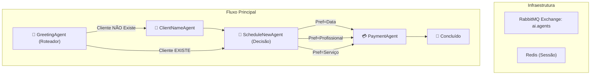

# 🤖 Julinho - Coreografador de Agentes Autônomos

Este projeto é um framework em TypeScript para orquestrar fluxos de trabalho complexos e dinâmicos utilizando múltiplos agentes autônomos. A comunicação entre os agentes é baseada em mensagens (coreografia), utilizando RabbitMQ, e o estado da sessão é gerenciado pelo Redis.

O fluxo de trabalho, incluindo as regras de roteamento e decisão, é definido de forma declarativa em um arquivo `workflow.json`, permitindo a fácil modificação da lógica sem a necessidade de alterar o código-fonte dos agentes.

---

## 🏛️ Visão Geral da Arquitetura

O sistema é construído sobre os seguintes princípios:

-   **Coreografia de Agentes:** Em vez de um orquestrador central, os agentes são autônomos e se comunicam através de um sistema de mensagens. Cada agente sabe qual evento (mensagem) deve processar e para qual próximo evento deve publicar, baseado nas regras do `workflow.json`.
-   **Roteamento Dinâmico:** Agentes do tipo `router` e `decision` utilizam um sandbox seguro (`vm2`) para avaliar condições definidas no JSON. Isso permite que o fluxo se adapte dinamicamente com base no contexto da conversa (ex: se um cliente já existe, o fluxo de cadastro é pulado).
-   **Estado Desacoplado:** O estado da sessão de cada usuário (ex: número de telefone, nome, preferência de agendamento) é mantido no Redis, permitindo que os agentes sejam *stateless* e escaláveis.

O diagrama abaixo ilustra o fluxo de agendamento de cliente implementado:



---

## 🚀 Como Executar Localmente

Siga os passos abaixo para iniciar o framework e executar o fluxo de agendamento de cliente.

### Pré-requisitos

-   **[Docker](https://www.docker.com/get-started/)**: Para executar o RabbitMQ e o Redis de forma isolada.
-   **[Bun](https://bun.sh/)**: Um runtime JavaScript rápido, utilizado para instalar dependências e executar os scripts.

### Passo 1: Iniciar a Infraestrutura com Docker

Para facilitar, um arquivo `docker-compose.yml` está incluído para iniciar os serviços necessários (RabbitMQ e Redis).

```bash
# Crie o arquivo docker-compose.yml com o conteúdo abaixo
touch docker-compose.yml
```

**Conteúdo do `docker-compose.yml`:**

```yaml
version: '3.8'
services:
  rabbitmq:
    image: rabbitmq:3-management
    ports:
      - "5672:5672"  # Porta para a aplicação
      - "15672:15672" # Porta para a interface de gerenciamento
    environment:
      - RABBITMQ_DEFAULT_USER=guest
      - RABBITMQ_DEFAULT_PASS=guest

  redis:
    image: redis:latest
    ports:
      - "6379:6379"
```

Agora, inicie os contêineres:

```bash
docker-compose up -d
```

Você pode acessar a interface de gerenciamento do RabbitMQ em `http://localhost:15672` (login: `guest`/`guest`) para visualizar as filas e mensagens.

### Passo 2: Instalar as Dependências

Utilize o `bun` para instalar todas as dependências do projeto.

```bash
bun install
```

### Passo 3: Iniciar o Motor do Workflow

Este comando inicia o `WorkflowEngine`, que se conecta ao RabbitMQ, lê o `workflow.json` e começa a escutar por mensagens nas filas apropriadas.

```bash
# Deixe este terminal rodando
bun start
```

Você verá a mensagem `WorkflowEngine started, waiting for messages...` quando estiver pronto.

### Passo 4: Disparar o Fluxo

Agora, em **outro terminal**, execute o script `trigger-flow` para simular a chegada de um novo usuário.

```bash
bun run src/trigger-flow.ts
```

Este script enviará uma mensagem inicial para o `GreetingAgent`. No terminal onde o motor está rodando (`bun start`), você verá os logs de cada agente sendo executado em sequência, mostrando o fluxo dinâmico em ação.

> **Nota:** O `GreetingAgent` simula aleatoriamente se um cliente já existe, e o `trigger-flow` escolhe uma preferência de agendamento aleatória. Execute o gatilho várias vezes para ver o framework tomar caminhos diferentes!

---

## 🛠️ Scripts Disponíveis

-   `bun start`: Inicia o motor principal do workflow (`WorkflowEngine`).
-   `bun test`: Roda a suíte de testes unitários com o test runner do Bun.
-   `bun build`: Compila o código TypeScript para JavaScript (saída no diretório `dist`).

---

## 📁 Estrutura do Projeto

```
.
├── .github/workflows/  # Workflows de CI/CD
├── src/
│   ├── agents/         # Implementação de cada agente
│   │   ├── index.ts
│   │   └── ...
│   ├── agent.ts        # Classe base abstrata para todos os agentes
│   ├── graph.ts        # Tipos e parser para o workflow.json
│   ├── index.ts        # Ponto de entrada para iniciar o motor
│   ├── node-executor.ts# Classe que instancia e executa um agente
│   ├── trigger-flow.ts # Script para disparar o fluxo
│   └── workflow-engine.ts # O orquestrador principal
├── tests/              # Testes unitários
├── package.json
├── tsconfig.json
└── workflow.json       # Definição declarativa do fluxo
```
